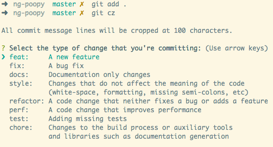

# Linting and Formatting
For consistency and predictable organization of code, this project uses [Eslint](https://eslint.org/) for linting. 

## The Setup
The configuration for Eslint can be found at the root of this project:
- Eslint - `.eslintrc.js`

VSCode is configured to automatically fix fixable linting errors on save. See `.vscode/settings.json`.

Within `package.json`, there scripts that you can run to lint and autofix the entire codebase.

```
"lint": "eslint --ext .js --ext .jsx .",
"fix": "eslint --ext .js --ext .jsx . --fix",
```

##  Git Commit hooks
Git commit hooks are a provision that allows us run custom scripts when specific events occur in the git workflow. [See more here](https://git-scm.com/book/en/v2/Customizing-Git-Git-Hooks).

For this project, we are using the clientside commit hooks to automatically lint and alphabetize staged files before they get pushed.

## Auto-alphabetization of translation files
This is meant to help ensure consistency and ease of reference within the translation files. For this, we are making use of git hooks via a package called [husky](https://typicode.github.io/husky/#/). Husky allows us to configure a defined pre-push command which triggers the `prepush` script within modified packages. The `prepush` script in `packages/frontend/package.json` is configured to run a group of commands that lint and autofix, sort translation files as well as runs our unit tests.

Within `package.json`, the block below defines this.

```
 "scripts": {
     ...,
    "prepush": "concurrently \"yarn run fix\" \"cd src/translations && npx sort-json * --ignore-case true\" \"yarn run test\""
  }
 ```
 
Two main things are ensured through this configuration:
- Staged translation files `src/translations/*.json"` get sorted in alphabetical order automatically using a package called [sort-json](https://github.com/kesla/sort-json)
- Staged `.js` and `.jsx` files get linted for any major linting errors and committing will fail until linting errors are resolved e.g unused vars. We can make the rules as tight or loose as we want through the configuration in `.eslintrc.js`.
- All unit tests must past before a developer can successfully push to remote.

## Proposal: Commit messages
Within `.husky/commit-msg`, there's a script that ensures consistent formatting with commit messages using the `commit-msg` git hook. 

The proposed format is:
```
git commit -m "{commit type goes here}: {commit information}"
```

Example:
```
git commit -m "feat: linting support using eslint"
```

The image below provides more information on the commit types.



Learn more about this conventional commit format [here](https://www.conventionalcommits.org/en/v1.0.0/#commit-message-with--to-draw-attention-to-breaking-change).